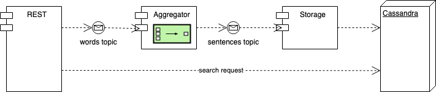

# Origin

## Architecture



## Content

- aggregator - aggregator component sources 
- cassandra - Docker configuration to create an image with predefined keyspace and tables 
- rest - rest component sources
- storage - storage component sources
- docker-compose.yaml -  Docker compose file to start all components together

## Prerequisites
Docker, Git

## Build 
```
git clone git@github.com:mgubaidullin/origin-spring.git
cd origin-spring
docker build -t origin/rest rest
docker build -t origin/aggregator aggregator
docker build -t origin/storage storage
docker build -t origin/cassandra cassandra
```

## How to
### Run in Docker Compose
```
docker-compose up 
```

### Open applications
REST Service Swagger UI
```
open http://localhost:8080/swagger-ui/index.html
```

Kafka topic browser
```
open localhost:8888
```